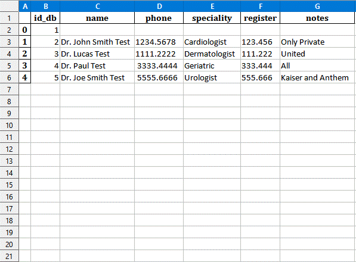

# **Una simple aplicación crud para una clínica en python**

 
# Sobre
> Esta sencilla aplicación crud está escrita en python 3 con tkinter/tkk y SQLite, puede registrar pacientes, médicos y citas.
>
>  

# Aspectos
> - CRUD (Crear, Leer, Actualizar, Eliminar) pacientes.
> - Médicos CRUD.
> - Consultas CRUD.
> - Acceso en inglés o portugués.
> - Use cualquier nombre para la base de datos, por ejemplo: 2023_database
> - Exportar a excel
> - Búsqueda automática por código postal o zip code para Brasil o USA.

# diseños
> ## Página principal - Pacientes (en inglés)
> 

> ## Página principal - Pacientes (en portugués)
> 

> ## Después de hacer clic en el botón de médicos en la página principal (en)
> 

> ## Después de hacer clic en el botón de consultas en la página principal (en)
> 

> ## Guardar en excel
> Finalmente, si hace clic en el botón 'Salvar Excel' en la página principal, se generará un archivo de Excel en xlsx con las siguientes tres pestañas:
> ### Registro de paciente en excel
> 
> ### Registro consultas en excel
> 
> ### Registro de médicos en excel
> 

# Modelos
> ## Base de datos - modelo
> 

# Tecnologías
> - Python 3
> - Tkinter/tkk
> - Base de datos SQLite
> - pandas
> - Sin bibliotecas externas, clases propias, para:
>     - Sql.
>     - ISO8601.py para manejo de tiempos y fechas.
>     - Internacionalización.

# Ejecutar la aplicación
> - La aplicación se puede invocar desde la línea de comando con la siguiente sintaxis:
>
>           python main.py 'idioma'  'database'   
>
> - Donde:
> - 'idioma' puede ser: 'en' o 'pt' (si se omite 'pt' será el idioma adoptado)
> Al configurar el idioma, se configurarán varias condiciones, por ejemplo, la búsqueda del código postal o zip code, respectivamente, en Brasil y Estados Unidos, así como la configuración de fecha y hora local.
> - 'database' es el nombre de la base de datos SQLite para se  leer o crear. (si se omite, se utilizará 'clinic.db')

# versión Pro
> - Personalizado para una clínica específica.
> - Atributos como inicio de sesión y seguridad.
> - Idioma específico que no sea pt/en, eg: español
> - Multiusuario.
> - Se ejecuta en la web o móvil.
> - Notificaciones e informes automáticos.
> - Funciones de copia de seguridad y registro.

# Autor
> Pedro Vitor Abreu
>
> <soft.pva@gmail.com>
>
> <https://github.com/softpva>