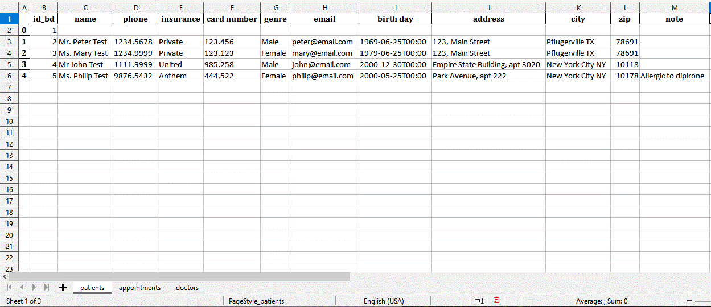

# **Uma simples aplicação para uma clínica em python**

 
# Sobre
> Este simples crud app foi escrito em python 3 com tkinter/tkk e SQLite, ele pode registrar pacientes, médicos e consultas.
>
>  

# Aspectos
> - CRUD (Criar,Ler,Atualizar,Apagar) pacientes.
> - CRUD médicos.
> - CRUD consultas.
> - Acesso em inglês ou em português.
> - Use qualquer nome para o banco de dados, eg: 2023_database
> - Exporte para o excel
> - Busca automática de endereços pelo CEP ou zip code para o Brazil ou para os USA.

# Layouts
> ## Página principal - Pacientes (em inglês)
>   

> ## Página principal - Pacientes (em português)
>   

> ## Após clicar no botão médicos na página principal (en)
>   

> ## Após clicar no botão consultas na página principal (en)
>   

> ## Salvar no excel
> Finalmente, se clicar no botão 'salvar excel' na página principal, um arquivo excel em xlsx será gerado com as seguintes três tabs:
> ### Registro de pacientes no excel
> 
> ### Registro de consultas no excel
>  
> ### Registro de médicos no excel
> 

# Models
> ## Modelo banco de dados
>  

# Tecnologias
> - Python 3
> - Tkinter/tkk
> - SQLite database
> - Pandas
> - Sem bibliotecas externas, classes próprias, para:
>     - SQL.
>     - ISO8601.py para manipulação de horas e datas.
>     - Internacionalização.
> - APIs:
>     - Busca via cep: https://viacep.com.br
>     - Busca via zip: https://api.zippopotam.us/us

# Rodando o app
> - O aplicativo pode ser chamado na linha de comando com a seguinte sintaxe:  
>
>           python main.py 'idioma'  'database'   
>
> - Onde:  
> - 'idioma' pode ser: 'en' ou 'pt' (se omitido 'pt' será o idioma adotado)  
>    A fixação do idioma configurará várias condições, por exemplo, a busca do cep ou zip code, respectivamente, no Brasil e nos Estado Unidos, convênios médicos, bem como as configurações locais de data e hora.
> - 'database' é o nome do banco de dados em SQLite a ser lido ou criado. (se omitido 'clinic.db' será utilizado)

# Versão pró
> - Personalizado para uma clínica específica.
> - Atributos como login e de segurança.
> - Idioma específico, além de pt/en.
> - Multiusuário.
> - Roda na web ou em mobile.
> - Notificações automáticas e relatórios.
> - Recursos de backup e log.

# Autor
> Pedro Vitor Abreu
>
> <soft.pva@gmail.com>
>
> <https://github.com/softpva>