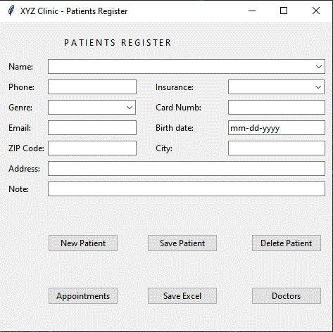
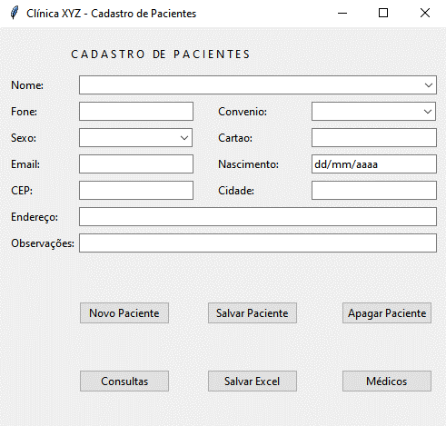
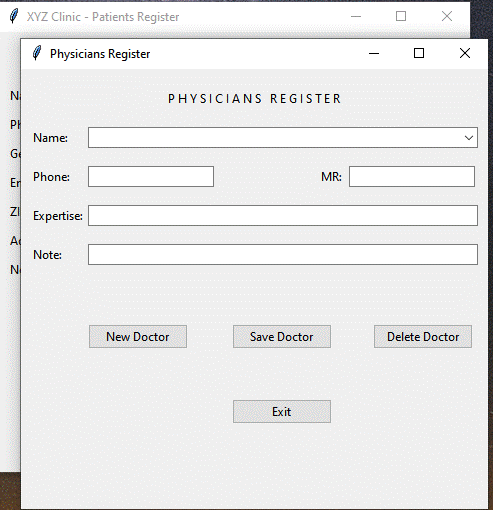
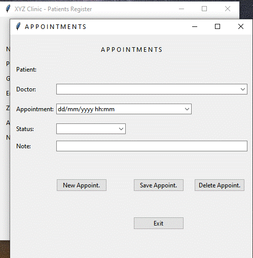
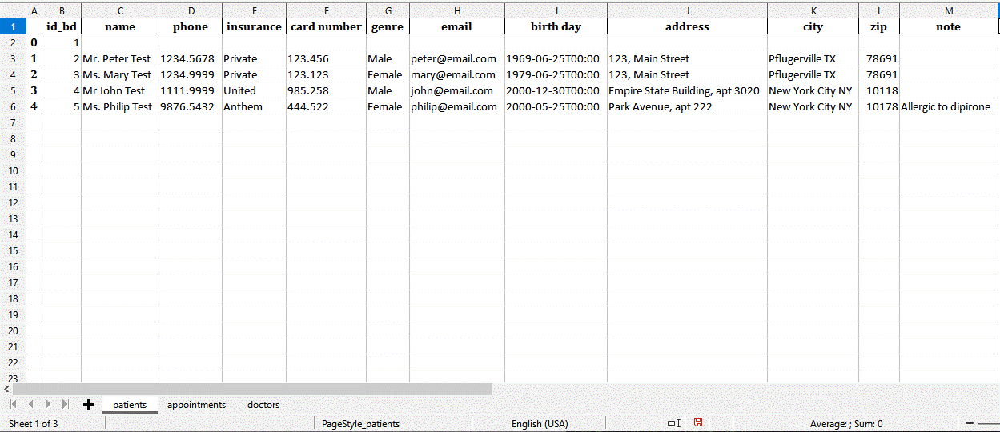
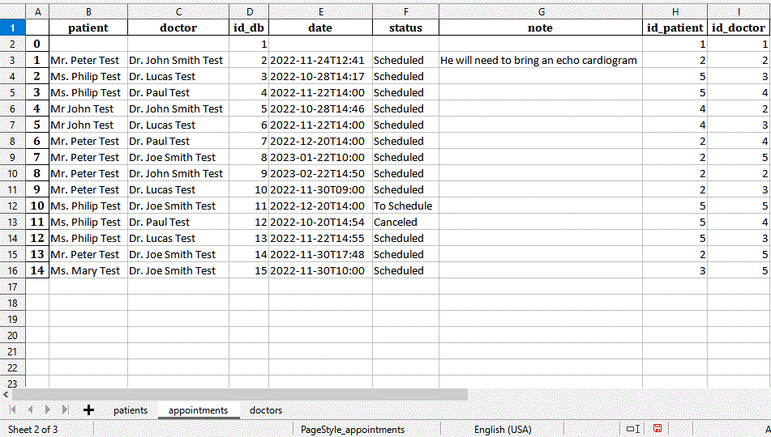
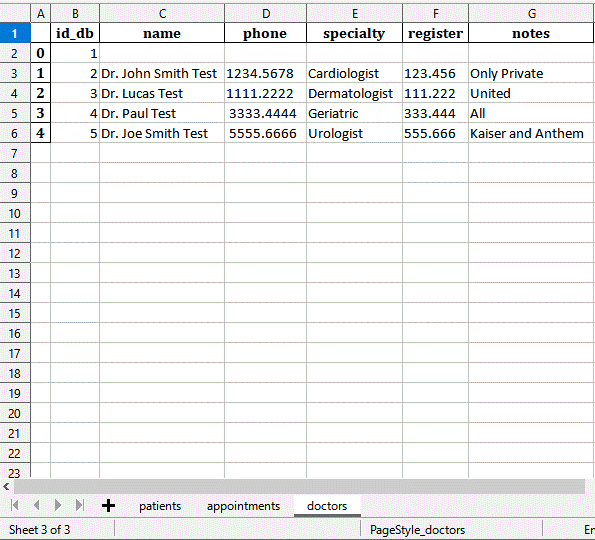

# A Simple Clinic Application in Python

This simple App was written in python 3 (tkinter/tkk) and SQLite, it can register patients, doctors and appointments.  
The use of python libraries such datetime or some bridge to relational database was not used, instead, it was used its own code and primary sql commands. In the same way we used a own functions (iso8601.py) to date manipulation. 

The app can be called at command line using the syntax:

- python main.py 'language'  'database' 

  -  Where:  
'language' can be: 'en' or 'pt' (if omitted 'pt' it'll be default)  
'database' is the name of SQLite database to be read or to be created. (if omitted 'clinic.db' it'll be used)

The language option will set several conditions, for example the search of zip or cep code in US or Brazil, respectively, or the local date configurations. (see bellow)

The main page - Patients Register (for English users):  

The main page - Patients Register (for Portuguese users):  
 

If the doctor button is clicked, the follow new screen will appear:

If the Appointments button is clicked, the follow new screen will appear:

And, at the end, if you click on the Save Excel button at the main page, an excel file xlsx will be generated with three tabs, one with the patient registers,  another with the respective medical appointments and the last tab with doctor's registers, as example images below:  

  
  

